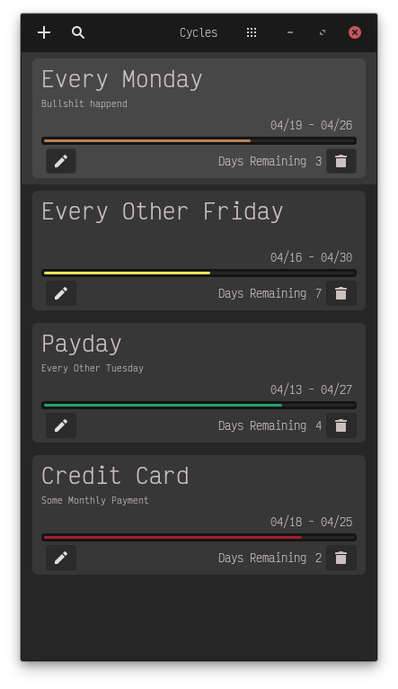
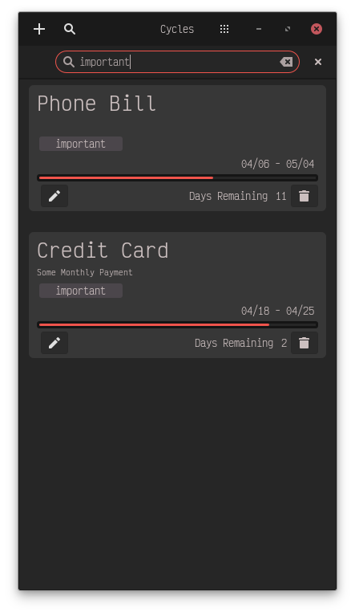
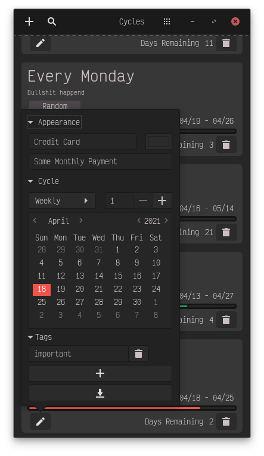

# Cycles

**[WIP]** Simple app to help track subscription progress on the Pinephone.

Unfortunatly this app is on hold until I actually receive my recently ordered PinePhone or librem 5 🤣.

  

### Features
   - Weekly, monthly and yearly cycles.
   - Import & Export to binary CBOR format
   - Search through label's, descriptions, and tags

### Bugs / TODO
   - The progress bar is basically half implemented. The `Description::render_arguments`
   needs to be rewritten in order to actually put the correct values. I would love
   help with this part as i am either to stupid or busy to figure this one out
   right now, Else i'll fix this when i can actually test the app.

   - Tags seem to be getting deleted randomly the more you mess with it / open close the app.

   - I think some of the controls might be to small for actually using on a phone
   I'm waiting to do much else to see if the UI has to be completely reworked.

   - Consider using GSettings to store cycle data instead of [sled](https://docs.rs/sled)
   database.

### Building

  Test on Linux Desktop using cargo **NOTE: requires libhandy be installed**

      cargo run

  This will have to be cross compiled when the time comes similar to how
  [Tubefeeder](https://github.com/Schmiddiii/Tubefeeder) is doing it.
